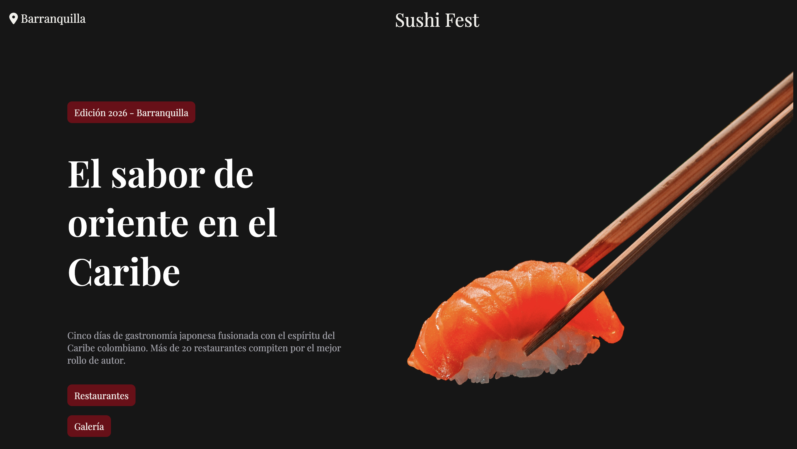

<div align="center">

# Gastronomic Festival Experience Platform

### Event Promotion & Visitor Engagement Website

A responsive web application designed to showcase culinary experiences, event information, and cultural activities through an engaging digital experience.

<br>


<br>

<a href="https://melissagarridos.github.io/">Portfolio</a> •
<a href="https://www.linkedin.com/in/melissavgs/">LinkedIn</a> •
<a href="https://github.com/melissagarridos">GitHub</a>

<br><br>


</div>

---

## Overview

Festivals and public events require a strong digital presence to attract visitors, communicate event information, and promote participant engagement.

This project delivers a modern web experience that centralizes festival information, highlights culinary attractions, and improves visitor accessibility through responsive and intuitive design.

The platform demonstrates frontend development, responsive web design, information architecture, and user experience principles.

---

## Business Problem

Event organizers often face challenges when communicating information effectively across multiple channels.

Common issues include:

- Limited event visibility
- Poor user engagement
- Fragmented event information
- Difficult navigation experiences
- Low digital accessibility

Without a centralized platform, visitors may struggle to access schedules, attractions, and event details.

---

## Solution

The Gastronomic Festival Experience Platform provides a single destination where visitors can explore festival offerings, access event information, and discover culinary experiences.

The application is designed to improve event awareness, visitor engagement, and overall user experience.

---

## Core Features

### Event Information

- Festival overview
- Event details
- Visitor information
- Location references

### Culinary Showcase

- Featured food experiences
- Gastronomic attractions
- Vendor presentation
- Cultural highlights

### User Experience

- Responsive design
- Mobile-first experience
- Intuitive navigation
- Clear information hierarchy

### Engagement

- Interactive sections
- Event discovery
- Visitor-oriented content

---

## User Journey

```text
Discover Festival
        │
        ▼
Explore Event Information
        │
        ▼
Review Attractions
        │
        ▼
Plan Attendance
        │
        ▼
Engage With Event
```

---

## Architecture

```text
Frontend Interface
        │
        ▼
Navigation System
        │
        ▼
Content Presentation
        │
        ▼
User Interaction Layer
        │
        ▼
Visitor Experience
```

---

## Technical Highlights

### Responsive Design

Optimized for desktop, tablet, and mobile devices.

### Information Architecture

Organizes event information into easily accessible sections.

### User Experience Design

Focused on discoverability, engagement, and accessibility.

### Frontend Development

Built using modern web technologies and responsive design principles.

---

## Tech Stack

| Category | Technology |
|-----------|------------|
| Structure | HTML5 |
| Styling | CSS3 |
| Interactivity | JavaScript |
| Design | Responsive Web Design |
| Deployment | GitHub Pages |

---

## Skills Demonstrated

### Frontend Development

- HTML5
- CSS3
- JavaScript
- Responsive Design

### User Experience

- Information Architecture
- User Journey Design
- Accessibility Considerations
- Mobile-First Development

### Product Thinking

- Event Promotion
- Visitor Engagement
- Digital Experience Design
- Content Organization

---

## Business Impact

This project demonstrates how digital experiences can support event promotion by:

- Increasing event visibility
- Improving information accessibility
- Enhancing visitor engagement
- Providing centralized communication
- Supporting attendee planning

---

## Future Improvements

- Event Registration
- Interactive Maps
- Vendor Directory
- Online Ticketing
- Schedule Management
- Event Notifications
- Social Media Integration
- Analytics Dashboard

---

## Learning Outcomes

This project strengthened practical experience in:

- Frontend Development
- Responsive Design
- UX/UI Principles
- Event Platform Design
- Information Architecture
- User-Centered Development

---

## Author

### Melissa Garrido

Software Development • Product Design • Data Analytics

Portfolio  
https://melissagarridos.github.io/

LinkedIn  
https://www.linkedin.com/in/melissavgs/

GitHub  
https://github.com/melissagarridos

---

## Project Status

Completed and available for portfolio review.
